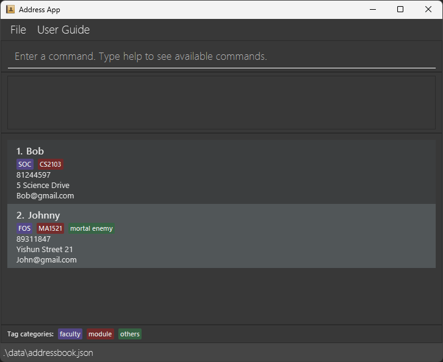

# coNnectUS
coNnectUS is a graphical contact tracking application built for National University of Singapore (NUS) students
* It allows users to store contact information of individuals met in NUS
* Operations are performed through text-based commands
  * The format of commands is inspired by **Unix** commands

## Getting started
Prerequisites: JDK 25 installed
1. Download the latest release of coNnectUS at **[coNnectUS Release Page](https://github.com/AY2627S1-CS2103T-T13-1/tp/releases)**
2. Run the following command in a terminal: `java -jar coNnectUS.jar` 

## Documentation
* For detailed documentation of this project, see the **[coNnectUS Product Website](https://ay2627s1-cs2103t-t13-1.github.io/tp/)**.

## Acknowledgements
*  This project is based on the AddressBook-Level3 project created by the [SE-EDU initiative](https://se-education.org).