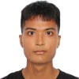
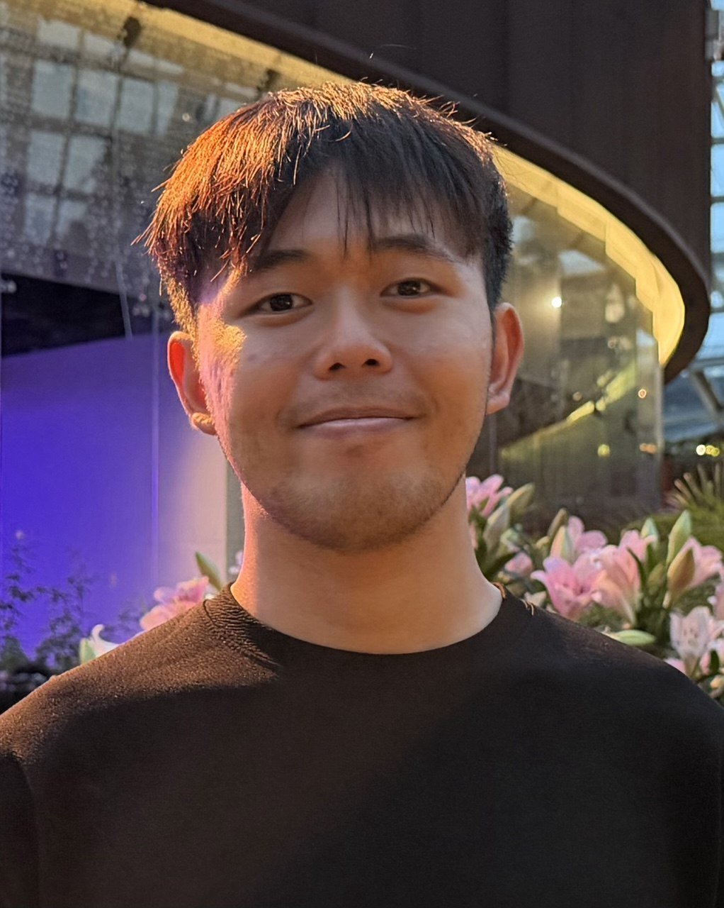
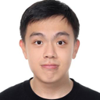
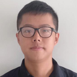
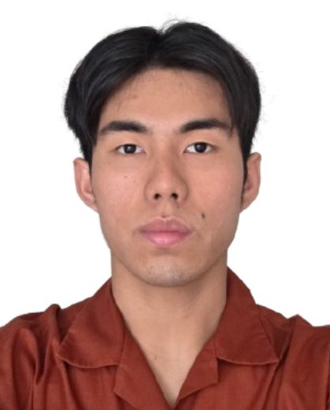

# About Us

We are a team based in the [School of Computing, National University of Singapore](http://www.comp.nus.edu.sg).

You can reach us at the email `seer[at]comp.nus.edu.sg`

## Project team

### Aidil

[[github](https://github.com/idealfarhand)]
[[portfolio](team/idealfarhand.md)]

* Role: Team Contributor
* Responsibilities: Feature Implementation

### Aloysius

[[github](https://github.com/Alloyshoes)]
[[portfolio](team/alloyshoes.md)]

* Role: Team Contributor
* Responsibilities: Feature Implementation

### Teo Shi Jie

[[github](https://github.com/shijieteo)]
[[portfolio](team/shijieteo.md)]

* Role: Team Member
* Responsibilities: Implementing features

### Ryan Ng

[[github](http://github.com/RyanNgCT)]
[[portfolio](team/RyanNgCT.md)]

* Role: Team Member
* Responsibilities: Testing

### Chong Kai Le

[[github](http://github.com/draxche)] [[portfolio](team/draxche.md)]

* Role: Team Member
* Responsibilities: Feature Implementation
